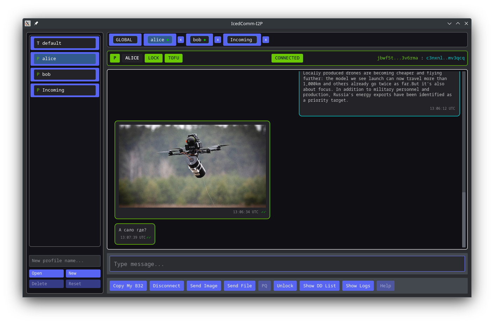
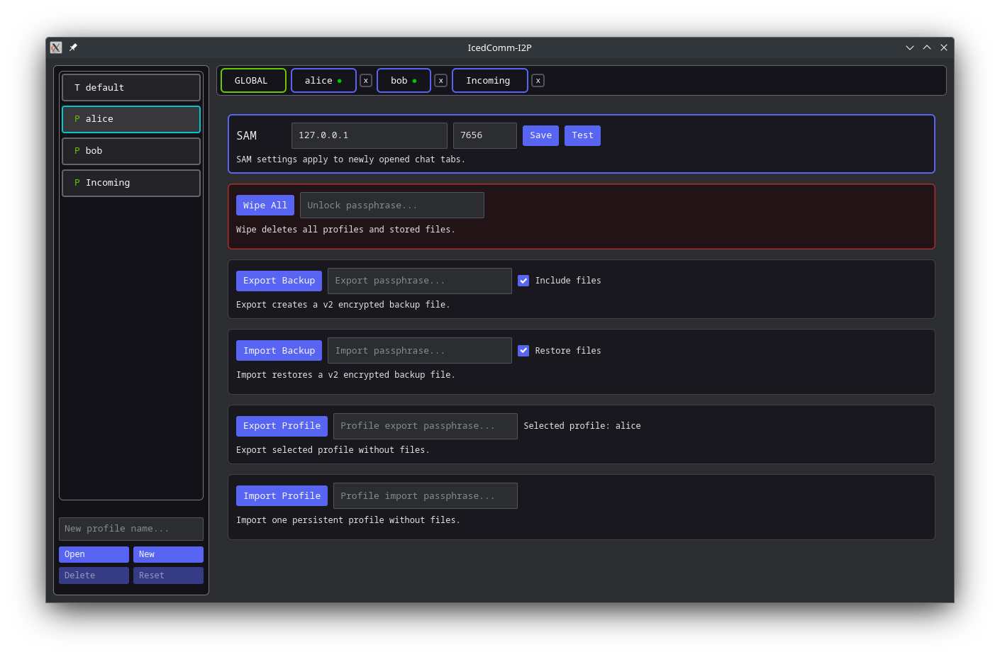

# IcedComm-I2P

**An Iced-powered, maximum-security GUI messaging tool for one-to-one communication over I2P.**

Current version: **1.0.0-beta.1**


### GUI Implementation Notice
This project is a graphical user interface (GUI) implementation built entirely on top of the original protocol, architecture, and core security features of [termchat-i2p](https://github.com/stanley-i2p/termchat-i2p). While the interface has been modernized using the Rust-based Iced framework, the underlying application logic strictly honors the native end-to-end encryption, compartmentalized per-profile model, TOFU peer pinning, and metadata-poor offline deaddrop system engineered by the original author.




## Status

IcedComm-I2P is ready for public beta testing. Core live chat, persistent profiles, offline deaddrop delivery, image/file transfer, encrypted local storage, backups, and GUI workflows are implemented.

This is still a beta release. Keep backups of important profiles and test new binaries carefully before relying on them for critical communication.

## Requirements

- Linux desktop environment capable of running an Iced/WGPU application
- I2P router with SAM enabled
- Java I2P or i2pd
- Default SAM endpoint: `127.0.0.1:7656`

The SAM host and port can be configured inside the `GLOBAL` tab. This supports local routers, remote routers, SSH forwarding, VPN setups, and non-standard SAM ports.

## Main Features

- Live one-to-one chat over I2P SAM streams
- Transient profile for temporary live sessions
- Persistent profiles for long-term peer relationships
- Lock/unlock persistent profiles to a specific peer
- TOFU-style peer identity pinning for persistent profiles
- Offline messaging through deaddrop servers
- Deaddrop server list management in the GUI
- Deaddrop server profiling and ranking
- Rust-to-Rust image transfer with sender-side preview resizing
- File transfer with size limits and secure local storage
- Delivery indicators for live and offline messages
- Encrypted full-storage vault on shutdown
- Encrypted full backup export/import
- Encrypted single-profile export/import
- Optional backup/restore of received files
- Global SAM settings and SAM test button
- Single-instance lock file to prevent concurrent access to the same storage

## Profiles

The app separates transient and persistent use.

**Transient profile**

- Intended for temporary live sessions
- Not locked to a long-term peer
- No offline deaddrop state

**Persistent profiles**

- Store a local I2P identity
- Can be locked to one peer
- Store peer address and TOFU data
- Store offline delivery state
- Store deaddrop server preferences and profiling data

Reserved profile names cannot be used for user profiles, including `default`, `__app__`, and `GLOBAL`.

## Offline Messaging

Offline delivery uses deaddrop servers. Messages are encrypted into opaque blobs and stored under derived per-message lookup keys.

The app keeps PUT and GET operations separate from live chat. Offline operation uses transient I2P access sessions for deaddrop communication. The GUI shows deaddrop activity indicators such as poll, put, hit, miss, and fail states.

Deaddrop runtime startup includes a readiness probe so the app waits until at least one configured deaddrop server accepts a SAM stream connection before reporting offline runtime as started.

## Image And File Transfer

Image transfer is intended as an inline preview feature. Images are resized on the sender side before transfer and displayed directly in chat bubbles.

File transfer is intended for full-size files and stores received files in the app's secure local files directory. Transfers are capped by the configured maximum file size.

Current limit:

- File transfer: `50 MiB`

## Local Storage

IcedComm-I2P stores plaintext runtime data under:

```text
~/.icedcomm-i2p
```

When the app is closed normally, storage is encrypted into:

```text
~/.icedcomm-i2p.vault
```

The plaintext directory is removed after successful vault encryption.

The app also creates a lock file:

```text
~/.icedcomm-i2p.app.lock
```

The lock file is used with an OS-level exclusive lock. Its purpose is to prevent multiple app instances from opening and modifying the same storage at the same time. The file itself may remain after exit; the active filesystem lock is what matters.

## Vault Passphrase

On first start, when no plaintext storage and no vault exist, the gate screen asks the user to set a storage passphrase.

On later starts, the same passphrase is required to decrypt the vault.

The passphrase is also required for dangerous global operations such as wiping all profiles and storage.

Uncatchable exits such as `kill -9`, system crash, or power loss cannot be handled by the app. Normal window close, Ctrl+C, and SIGTERM paths attempt to encrypt storage before shutdown.

## Backup And Restore

The `GLOBAL` tab contains backup and restore operations.

Supported operations:

- Full encrypted backup export
- Full encrypted backup import
- Single-profile encrypted export
- Single-profile encrypted import
- Wipe all profiles and files

Full backups can include or exclude the secure `files` directory. Single-profile backups do not include files.

Full export/import requires chat tabs to be closed to avoid changing profile state while backup operations are running.

Backup passphrases are separate from the local storage vault passphrase. A backup can use the same passphrase if the user wants, but it does not have to.

## Security Model

The design follows the Termchat-I2P security model:

- Communication happens over I2P
- App-level E2E framing is used above I2P transport
- Profiles are compartmentalized
- Persistent profiles are locked to one peer
- Peer destination identity is pinned with TOFU
- Offline blobs are opaque and metadata-minimal
- Deaddrop storage does not need to understand message contents
- Local storage is encrypted when the app is closed

The most important practical risks remain endpoint compromise, malware on the local machine, operational mistakes, implementation bugs, and misuse of trust decisions.

## Building From Source

Most users should use released binaries. Developers can build locally with Cargo.

From this directory:

```bash
cargo build --release
```

Run locally:

```bash
cargo run
```

During development, use:

```bash
cargo check
```

## Repository Layout

Important Rust GUI files:

- `src/main.rs` - Iced app entry point
- `src/app.rs` - main GUI state, message handling, tabs, chat bubbles, transfers, and runtime flow
- `src/app_home.rs` - `GLOBAL` tab UI and global operations
- `src/sam.rs` - SAM/I2P client logic
- `src/protocol.rs` - framed message protocol
- `src/e2e.rs` - end-to-end encryption helpers
- `src/deaddrop.rs` - offline deaddrop client
- `src/storage.rs` - profile and app storage
- `src/vault.rs` - encrypted local storage vault
- `src/backup.rs` - backup/import/export support

Reference implementation:

- `../termchat-i2p/` - Python terminal implementation and protocol reference
- `../termchat-i2p/SERVER/` - deaddrop server implementation and documentation

## Compatibility

The Rust GUI follows the Termchat-I2P protocol family. Some newer Rust features, such as binary image preview transfer, may need corresponding implementation in the Python reference before full Rust/Python feature parity is available.

Backup format naming intentionally keeps Termchat-I2P compatibility identifiers where needed.

## Release Notes For 1.0.0-beta.1

This first public beta focuses on:

- Rust GUI usability
- Persistent one-to-one chat
- Offline deaddrop delivery
- Encrypted local vault
- Backup/import workflows
- Image and file transfer
- SAM endpoint configuration
- Public binary testing

Users should keep backups and report issues with startup, vault encryption, profile import/export, offline delivery, image transfer, and router/SAM compatibility.
