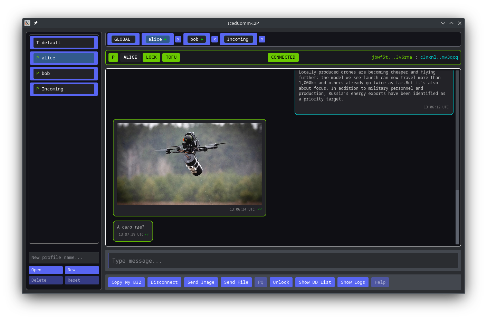
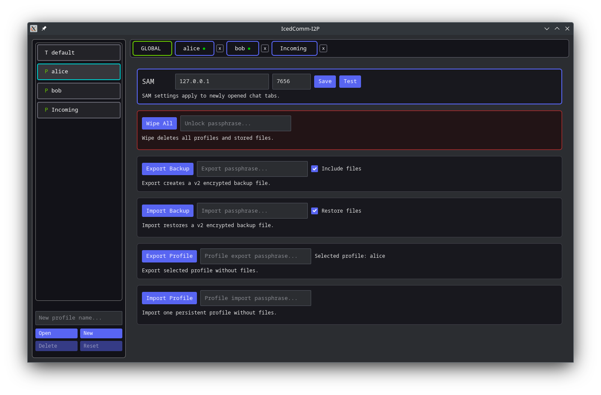

# IcedComm-I2P

**An Iced-powered, maximum-security GUI messaging tool for one-to-one communication over I2P.**

Current version: **1.0.0**


### GUI Implementation Notice
This project is the Rust/Iced desktop implementation of the CommTools-I2P protocol and architecture, originally implemented by [termchat-i2p](https://github.com/stanley-i2p/termchat-i2p). While the interface has been modernized using the Rust-based Iced framework, the underlying application logic strictly honors the native end-to-end encryption, compartmentalized per-profile model, TOFU peer pinning, and metadata-poor offline deaddrop system engineered by the original author.




## Status

IcedComm-I2P is ready for public beta testing. Core live chat, persistent profiles, offline deaddrop delivery, image/file transfer, encrypted local storage, backups, and GUI workflows are implemented.

This is still a beta release. Keep backups of important profiles and test new binaries carefully before relying on them for critical communication.

## Requirements

- Linux desktop environment capable of running an Iced/WGPU application
- I2P router with SAM enabled
- Java I2P or i2pd
- Default SAM endpoint: `127.0.0.1:7656`

The SAM host and port can be configured inside the `GLOBAL` tab. This supports local routers, remote routers, SSH forwarding, VPN setups, and non-standard SAM ports.

## Main Features

- Live one-to-one chat over I2P SAM streams
- Transient profile for temporary live sessions
- Persistent profiles for long-term peer relationships
- Lock/unlock persistent profiles to a specific peer
- TOFU-style peer identity pinning for persistent profiles
- Offline messaging through deaddrop servers
- Deaddrop server list management in the GUI
- Deaddrop server profiling and ranking
- Rust-to-Rust image transfer with sender-side preview resizing
- File transfer with size limits and secure local storage
- Delivery indicators for live and offline messages
- Encrypted full-storage vault on shutdown
- Encrypted full backup export/import
- Encrypted single-profile export/import
- Optional backup/restore of received files
- Global SAM settings and SAM test button
- Single-instance lock file to prevent concurrent access to the same storage

## Profiles

The app separates transient and persistent use.

**Transient profile**

- Intended for temporary live sessions
- Not locked to a long-term peer
- No offline deaddrop state

**Persistent profiles**

- Store a local I2P identity
- Can be locked to one peer
- Store peer address and TOFU data
- Store offline delivery state
- Store deaddrop server preferences and profiling data

Reserved profile names cannot be used for user profiles, including `default`, `__app__`, and `GLOBAL`.

## Offline Messaging

Offline delivery uses deaddrop servers. Messages are encrypted into opaque blobs and stored under derived per-message lookup keys.

The app keeps PUT and GET operations separate from live chat. Offline operation uses transient I2P access sessions for deaddrop communication. The GUI shows deaddrop activity indicators such as poll, put, hit, miss, and fail states.

Deaddrop runtime startup includes a readiness probe so the app waits until at least one configured deaddrop server accepts a SAM stream connection before reporting offline runtime as started.

## Image And File Transfer

Image transfer is intended as an inline preview feature. Images are resized on the sender side before transfer and displayed directly in chat bubbles.

File transfer is intended for full-size files and stores received files in the app's secure local files directory. Transfers are capped by the configured maximum file size.

Current limit:

- File transfer: `50 MiB`

## Local Storage

IcedComm-I2P stores plaintext runtime data under:

```text
~/.icedcomm-i2p
```

When the app is closed normally, storage is encrypted into:

```text
~/.icedcomm-i2p.vault
```

The plaintext directory is removed after successful vault encryption.

The app also creates a lock file:

```text
~/.icedcomm-i2p.app.lock
```

The lock file is used with an OS-level exclusive lock. Its purpose is to prevent multiple app instances from opening and modifying the same storage at the same time. The file itself may remain after exit; the active filesystem lock is what matters.

## Vault Passphrase

On first start, when no plaintext storage and no vault exist, the gate screen asks the user to set a storage passphrase.

On later starts, the same passphrase is required to decrypt the vault.

The passphrase is also required for dangerous global operations such as wiping all profiles and storage.

Uncatchable exits such as `kill -9`, system crash, or power loss cannot be handled by the app. Normal window close, Ctrl+C, and SIGTERM paths attempt to encrypt storage before shutdown.

## Backup And Restore

The `GLOBAL` tab contains backup and restore operations.

Supported operations:

- Full encrypted backup export
- Full encrypted backup import
- Single-profile encrypted export
- Single-profile encrypted import
- Wipe all profiles and files

Full backups can include or exclude the secure `files` directory. Single-profile backups do not include files.

Full export/import requires chat tabs to be closed to avoid changing profile state while backup operations are running.

Backup passphrases are separate from the local storage vault passphrase. A backup can use the same passphrase if the user wants, but it does not have to.

## Security Model

The design follows the Termchat-I2P security model:

- Communication happens over I2P
- App-level E2E framing is used above I2P transport
- Profiles are compartmentalized
- Persistent profiles are locked to one peer
- Peer destination identity is pinned with TOFU
- Offline blobs are opaque and metadata-minimal
- Deaddrop storage does not need to understand message contents
- Local storage is encrypted when the app is closed

The most important practical risks remain endpoint compromise, malware on the local machine, operational mistakes, implementation bugs, and misuse of trust decisions.

## Building From Source

Most users should use released binaries. Developers can build locally with Cargo.

From this directory:

```bash
cargo build --release
```

Run locally:

```bash
cargo run
```

During development, use:

```bash
cargo check
```

## Compatibility

The Rust GUI implements the CommTools-I2P protocol family shared with Termchat-I2P. Some newer Rust features, such as binary image preview transfer, may need corresponding implementation in the Python reference before full Rust/Python feature parity is available.

Backup format naming intentionally keeps Termchat-I2P compatibility identifiers where needed.

## Release Notes For 1.0.0-beta.1

This first public beta focuses on:

- Rust GUI usability
- Persistent one-to-one chat
- Offline deaddrop delivery
- Encrypted local vault
- Backup/import workflows
- Image and file transfer
- SAM endpoint configuration
- Public binary testing

Users should keep backups and report issues with startup, vault encryption, profile import/export, offline delivery, image transfer, and router/SAM compatibility.


# IcedComm-I2P Architecture And Security Model

This document describes the architectural model of IcedComm-I2P, the Rust/Iced graphical implementation of the Termchat-I2P protocol family. It focuses on why the design is resistant to strong network adversaries when operated entirely inside I2P, how the offline deaddrop model works, and how stable deaddrop servers can spread through normal user relationships without requiring a central service.

IcedComm-I2P is designed around one core idea: the network, routers, relay services, and deaddrop servers should not need to be trusted with message contents or durable user identity. Trust is kept at the endpoints and in explicit user profile decisions.

## Security Assumption

The primary network assumption is that communication happens only over I2P destinations and I2P SAM streams.

Under I2P's destination model, the peer's b32 address is derived from the peer's cryptographic destination. A successful connection to that destination is therefore not equivalent to a normal Internet connection to an IP address; it is a connection to a cryptographic identity. In this model, classic network MITM against a known b32 destination is not considered practical in the same way it is for ordinary IP routing.

The app still adds its own security layers above I2P:

- persistent profiles pin peer identity with TOFU-style state
- live messages are wrapped in app-level encrypted frames after key exchange
- offline messages are encrypted into opaque deaddrop blobs
- local storage is encrypted into a vault when the app is closed normally
- profile state is compartmentalized so one profile does not become a universal identity

This means I2P provides the anonymous transport and destination authenticity, while the application provides profile separation, message framing, offline secrecy, local storage encryption, and user-level trust decisions.

## High-Level Components

The Rust app is organized around these major layers:

- `src/main.rs` starts the Iced application.
- `src/app.rs` owns most GUI state, tabs, profile state, chat bubbles, message handling, transfers, groups, deaddrop runtime state, and subscriptions.
- `src/app_home.rs` contains the global/admin UI.
- `src/sam.rs` handles I2P SAM communication.
- `src/protocol.rs` defines the framed message protocol.
- `src/e2e.rs` implements live session encryption and offline blob encryption helpers.
- `src/deaddrop.rs` implements the client side of offline deaddrop PUT/GET.
- `src/storage.rs` stores profiles, group metadata, offline counters, DD stats, and app configuration.
- `src/vault.rs` encrypts/decrypts the local plaintext storage directory.
- `src/backup.rs` handles encrypted backup import/export.

The UI presents these layers as profiles, tabs, status indicators, global operations, deaddrop panels, group panels, and backup/storage controls. Internally, the important separation is between transient profiles, persistent one-to-one profiles, offline deaddrop runtime, and group chat runtime.

## Profile Compartmentalization

Profiles are not cosmetic. They are security compartments.

### Transient Profile

The transient profile is for temporary live communication. It does not carry long-term offline state and is not intended to be a durable identity compartment.

Transient mode is useful when a user wants live communication without binding the current session to a persistent peer relationship.

### Persistent One-To-One Profiles

A persistent profile has its own local I2P destination and can be locked to one peer. Once locked, the profile stores:

- local destination data
- peer b32 address
- peer destination data
- TOFU state
- deaddrop server list
- deaddrop server profiling data
- offline shared secret
- offline send/receive counters

This is deliberately narrow. A locked profile is a compartment for one long-term relationship, not a global identity reused everywhere. If a user has several sensitive relationships, each can live in a separate profile with separate addressing and separate offline state.

### Groups

Group chats use a separate group model and separate I2P identities. They are live fan-out chats and do not reuse the one-to-one locked/offline model. This prevents group features from weakening the simpler one-to-one design.

Groups are intended to be operationally separate from persistent one-to-one profiles:

- group identities are not the same as one-to-one identities
- group membership is represented as a roster
- owner/admin actions are separate from profile actions
- offline delivery is not part of the group model

This separation matters because one-to-one security and group-chat security have different requirements. Keeping them separate reduces the risk that group convenience features accidentally weaken locked one-to-one communication.

## Live One-To-One Model

Live one-to-one chat uses I2P SAM stream connections. The peer's I2P destination is converted to a b32 address and compared against stored profile state where applicable.

For persistent locked profiles, the app verifies that the peer destination matches the stored locked peer. If it does not match, the session is treated as a TOFU mismatch and live readiness is revoked.

After connection setup, the app exchanges application key material and derives a live session key. User message payloads are then encrypted with authenticated encryption before being placed into protocol frames.

Important properties:

- the I2P destination already identifies the remote endpoint cryptographically
- the profile pins the expected peer for persistent use
- the app-level session key protects message payloads above I2P
- delivery acknowledgements are tied to message IDs
- heartbeat frames detect dead peers more reliably than passive socket state

The live model is therefore not just "a socket over I2P." It is a profile-bound, identity-checked, encrypted application session over an anonymous authenticated transport.

## Framed Protocol

The protocol layer uses typed frames with:

- magic bytes
- protocol version
- message type
- message ID
- payload length
- payload

Different frame types carry chat messages, delivery acknowledgements, identity/control signals, file transfer frames, image transfer frames, key exchange frames, offline secret sync frames, and group control frames.

The frame structure provides a stable protocol envelope, while encryption is applied to sensitive payloads before they are placed inside frames.

## Offline Messaging Model

Offline messaging is intentionally different from live messaging. It does not require both peers to be online at the same time. Instead, it uses deaddrop servers as untrusted mailboxes.

The model has three major pieces:

- a per-locked-peer offline shared secret
- deterministic per-message deaddrop lookup keys
- encrypted opaque blobs stored on one or more deaddrop servers

### Offline Shared Secret

The offline shared secret is a random 32-byte secret established between two locked peers during a live trusted session. It is stored in the profile's offline state.

Only the two endpoints should have this secret. Deaddrop servers do not receive it.

The offline secret is synchronized over the locked live session using the protocol `X` frame. The `X` payload is protected by the live app-level E2E encryption layer, so the secret is not exposed as a raw control payload on the SAM stream. The frame type identifies the operation, but the secret bytes themselves are encrypted before transmission.

The offline secret is used to derive:

- deaddrop lookup keys
- offline blob encryption keys

This means the server cannot determine which peer relationship a key belongs to, cannot predict future keys, and cannot decrypt stored blobs.

### Directional Deaddrop Keys

For each offline message, the app derives a lookup key from:

- offline shared secret
- lower sorted b32 identity
- higher sorted b32 identity
- direction label
- message index

The direction label prevents both peers from writing to the same key space. The send side and receive side are complementary. One side's send direction is the other side's receive direction.

The resulting deaddrop key is a SHA-256 hex string. To the deaddrop server it looks like a random mailbox key.

### Offline Blob Encryption

Before upload, the app builds a normal protocol frame. For offline text, the inner chat payload is already encrypted with the live message encryption helper. The encoded frame is then encrypted again as an offline blob using a key derived from the offline shared secret and both peer b32 IDs.

The server stores only:

- lookup key
- encrypted blob bytes

The server does not know:

- plaintext message
- frame contents
- sender profile name
- receiver profile name
- peer relationship
- offline shared secret
- next or previous keys

### Receive Window

The receiver polls a small window of expected receive indexes. When it finds and successfully decrypts a valid blob, it records the receive index as consumed and advances the receive base.

This gives the protocol resilience against missed polls or temporary server failures without making the client scan an unlimited key space.

### Replay Resistance

A deaddrop server may keep old blobs, but replay is limited by the client state:

- clients only poll expected keys
- consumed receive indexes are tracked
- duplicate blob hashes are tracked
- receive base advances after successful messages

An old blob under an old key is not useful once the receiver no longer asks for that key. Replay risk mainly exists around state rollback, backups restored from old state, bugs, or repeated responses before the receiver advances state.

## Deaddrop Server Trust Model

Deaddrop servers are explicitly untrusted.

A malicious deaddrop server can:

- delete blobs
- refuse PUT or GET
- return `MISS` falsely
- return `ERR`
- delay responses
- log timing
- log blob sizes
- log lookup keys
- try denial of service

A malicious deaddrop server should not be able to:

- decrypt message content
- forge valid messages
- derive future mailbox keys
- derive past mailbox keys without stored key logs
- learn profile names
- learn the offline shared secret
- learn the peer b32 addresses from the mailbox key alone

This is the correct trust boundary. Deaddrop servers are availability helpers, not confidentiality providers.

Offline PUT and GET operations use transient/ephemeral I2P client destinations for deaddrop access. These addresses are not the locked one-to-one profile addresses and are not durable social identities. This is important: even a deaddrop server that logs every request sees temporary client destinations plus random-looking mailbox keys, not the stable b32 identity of either chat participant.

## DD Server Replication

Offline PUT can store the same encrypted blob on multiple active deaddrop servers. The receiver can poll multiple active servers for the expected key.

Replication improves availability:

- one server can be down
- one server can lie with `MISS`
- one server can delete data
- one server can be slow

The client can still receive the message if another active server has the blob.

Replication also distributes trust. No single deaddrop server has to be reliable or honest. A server can damage availability only for the messages it exclusively controls.

## Deaddrop Profiling And Ranking

Each persistent profile stores a deaddrop server list and profiling statistics. The app tracks per-server PUT and GET outcomes and latency information.

Statistics include:

- successful PUT count
- failed PUT count
- successful GET/MISS response count
- failed GET count
- last success time
- latency exponential moving average
- latency sample count

Servers are ranked from this data. The app uses the top active replicas, currently capped by `MAX_ACTIVE_DEADDROP_REPLICAS`.

The intent is practical:

- stable servers naturally rise
- unreliable servers naturally fall
- users can keep a larger reserve list
- active use stays bounded
- the app does not overload every known server for every operation

Newly added servers receive a blank stats entry. They are not automatically probed forever in the background. A server becomes profiled when it is part of the active replica set and participates in real PUT/GET operations.

## Diffusion Of Stable DD Servers

The deaddrop ecosystem can improve without a central registry by allowing stable server knowledge to spread through real peer relationships.

The model is:

1. A profile starts with bootstrap deaddrop servers.
2. Users add or remove servers based on operation.
3. The app records server performance.
4. Stable servers rise in local ranking.
5. Locked peers can share deaddrop server lists over the live channel.
6. Each peer merges valid new servers into its own profile list.
7. Each profile continues ranking based on its own measurements.

This creates a diffusion model. Good servers can spread through the social graph of locked relationships, but each client still measures and ranks locally. There is no need for one global authority that declares which servers are trusted.

Security benefit:

- deaddrop server discovery is decentralized
- users are not forced to trust a central list
- local performance determines active use
- malicious or unreliable servers are pushed down by failures

Availability benefit:

- stable servers can become widely known
- users can maintain reserve lists
- active replicas stay limited
- the network can adapt as servers disappear or degrade

Privacy benefit:

- server list sharing happens inside locked peer channels
- servers do not need accounts
- servers do not need user registration
- server operators do not need to know who is using them

## Local Storage Model

Runtime plaintext storage lives under:

```text
~/.icedcomm-i2p
```

When the app closes normally, storage is encrypted into:

```text
~/.icedcomm-i2p.vault
```

After successful vault encryption, the plaintext directory is removed.

The storage vault protects at-rest data when the app is not running. It is not meant to protect against malware already running as the user while the app is open and storage is decrypted.

The app also uses a lock file:

```text
~/.icedcomm-i2p.app.lock
```

The lock file is backed by an OS-level exclusive lock. Its purpose is to prevent two app instances from modifying the same storage simultaneously.

## Backup Model

Backups are encrypted separately from the local storage vault. Backup passphrases do not have to be the same as the vault passphrase.

The app supports:

- full encrypted backup export/import
- single-profile encrypted export/import
- optional inclusion of secure received files in full backups
- dangerous wipe/import flows guarded by confirmation and passphrase checks

This allows migration and recovery while preserving the compartment model.

## File And Image Transfer

File transfer is live-only and stores received files in the secure local files directory. It is intended for original files and larger data.

Image transfer is treated as an inline preview feature. The sender resizes/compresses the image before transfer. Received images are displayed in bubbles and are not treated as full archival file transfer.

This distinction matters:

- images are conversational previews
- files are explicit high-trust transfers
- offline deaddrop blobs stay small and reliable

Potential offline image support should follow the same philosophy: small preview images only, not original media files.

## Group Chat Model

Group chat is a separate live fan-out design.

Each group participant has a group-specific I2P identity. Group communication does not reuse one-to-one locked identities. This prevents one-to-one relationship metadata from leaking into group contexts.

The group owner/admin model controls invite generation and roster changes. Roster sync is signed by the owner/admin state so normal members cannot authoritatively rewrite the group roster through the app protocol.

Group messaging is live only. Offline deaddrop delivery is intentionally not part of group chat.

Security properties:

- group identities are separate from one-to-one identities
- membership is explicit
- admin/owner actions are separated from member actions
- roster changes are controlled
- group feature development does not alter one-to-one offline state

## Adversary Analysis

### Passive Network Observer

On the public Internet side, an observer sees I2P traffic, not direct peer-to-peer app traffic. Message contents and peer destinations are hidden by I2P routing.

The app also encrypts sensitive payloads above I2P, so even a local observation point that sees framed app payloads should not read normal message content after the E2E session is ready.

### Malicious I2P Participant

A random I2P participant cannot impersonate a known b32 destination. Persistent profiles also pin expected peer destination state.

If a user manually accepts or locks the wrong peer, the app cannot fix that social trust error. TOFU protects continuity after the first trust decision; it does not prove the first decision was correct.

### Malicious Deaddrop Server

A malicious deaddrop server can harm availability but should not break confidentiality or integrity of offline messages.

The server sees random-looking keys and encrypted blobs. It can log timing and sizes. It cannot decrypt content without endpoint secrets.

### Colluding Deaddrop Servers

Colluding servers can combine timing and size observations. This may help them infer activity patterns. It still should not reveal message plaintext or profile names.

Using several independently operated servers improves availability but does not completely remove timing correlation.

### Compromised Endpoint

Endpoint compromise is the strongest practical threat. If malware reads process memory, captures the vault passphrase, modifies the binary, or reads plaintext storage while the app is running, it can bypass most application security.

The app's architecture reduces network trust, not endpoint trust.

### Remote SAM Endpoint

If SAM is forwarded over a remote network path, normal message contents remain protected by the app-level E2E layer. Live chat payloads, file/image payloads after E2E wrapping, group message payloads after group E2E setup, and offline deaddrop blobs should not become readable merely because the SAM endpoint is remote.

The realistic remote SAM concern is metadata and availability, not message plaintext. A remote SAM endpoint or an observer on the app-to-SAM path may see SAM commands, connection timing, stream setup activity, and the I2P destinations the app asks SAM to connect to. It can also delay, drop, or refuse connections. It should not be able to decrypt properly E2E-protected application payloads.

For remote routers, users should prefer SSH forwarding, VPN, or another protected channel to the SAM endpoint.

## Traffic Analysis Limits

The system is strong against content disclosure, but no messaging system can honestly claim perfect invisibility against all timing analysis.

Potentially observable by a malicious deaddrop server:

- when a PUT arrives
- when a GET arrives
- blob size
- lookup key
- whether two events are close in time
- temporary I2P client destinations used for the deaddrop operation

Not directly observable from the DD data alone:

- plaintext message
- profile name
- human identity
- peer b32 pair
- offline shared secret
- future mailbox keys
- stable one-to-one profile address

Because offline PUT/GET uses transient/ephemeral deaddrop access destinations, timing observations are stripped of the most useful stable identifier. A server can see that some temporary I2P destination performed a PUT or GET for a random-looking key at a given time, but that does not directly identify the locked profile, the peer, or the relationship. In practical terms, this makes durable social-graph construction from deaddrop logs extremely weak, especially when multiple independently operated deaddrop servers are used and active servers are ranked/rotated by observed reliability.

This is why the architecture is best described as highly resistant to content compromise and durable identity leakage. Availability attacks remain possible, and a powerful adversary can always try broad timing analysis, but the offline model deliberately denies DD servers the stable identifiers that normally make social-graph building useful.

## Why The Architecture Is Strong

The strength comes from layered separation:

- I2P hides network location and provides destination-based identity.
- Profiles prevent one identity from being reused everywhere.
- Persistent profiles pin peer identity.
- Live message payloads are encrypted above I2P.
- Offline blobs are encrypted before reaching untrusted servers.
- Offline deaddrop PUT/GET uses transient access addresses instead of stable profile addresses.
- Deaddrop keys are derived from high-entropy secrets and per-message indexes.
- Deaddrop servers are replicated and ranked.
- Local storage is encrypted at rest when the app is closed.
- Backups are encrypted independently.
- Groups use separate identities and separate runtime logic.

No single server is trusted with both routing truth and content. No deaddrop server is trusted with plaintext. No profile needs to become a universal identity. No group identity needs to be the same as a one-to-one identity.

This is a strong architecture for an I2P-native messenger because it matches I2P's strengths instead of trying to imitate a clearnet messenger.

## Known Hardening Items

The current architecture is strong, but some items should remain on the hardening list:

- Continue auditing control frames so secrets are never placed in plaintext frame payloads.
- Consider explicit caps for live image preview byte size separate from file transfer size.
- Consider small offline image previews only if implemented within the DD blob size model.
- Consider optional background probing for reserve deaddrop servers if it can be done without causing unnecessary SAM/I2P load.
- Continue testing shutdown/vault behavior on Linux, macOS, and Windows.
- Continue testing group roster edge cases with multiple platforms and multiple participants.

These are hardening tasks, not a replacement for the core model.

## Summary

IcedComm-I2P is built as a compartmentalized I2P-native messenger. Persistent one-to-one profiles are locked to specific peers, live traffic is encrypted above I2P, offline messages are stored as opaque encrypted deaddrop blobs, and deaddrop servers are treated as disposable availability infrastructure rather than trusted services.

The result is a design that is very strong against network adversaries, malicious deaddrop servers, and metadata-heavy centralized service models. Its main remaining risks are the realistic ones: endpoint compromise, user trust mistakes, implementation bugs, remote SAM exposure, denial of service, and timing analysis.

Within the intended I2P-only threat model, the architecture provides a high degree of confidentiality, compartmentalization, and operational resilience.

## Metadata In This Model

IcedComm-I2P is designed to keep metadata minimal and compartmentalized. The app cannot make metadata disappear completely, but it avoids the common centralized-messenger pattern where one service sees stable accounts, contact lists, device identifiers, IP addresses, and delivery events.

### Metadata Not Centralized

There is no central IcedComm account server that learns:

- user registration identity
- phone number
- email address
- global account ID
- contact list
- profile list
- group list
- social graph
- IP address
- global online/offline presence

The app does not require a provider-operated identity service. I2P destinations are the network identities, and profiles compartmentalize those identities locally.

### Metadata Visible To A Live Peer

A live peer naturally knows:

- the b32 destination used for that relationship
- the time of the live session
- message timing during that session
- approximate message sizes at the encrypted-frame level
- whether delivery acknowledgements are received

This is unavoidable because the peer is the intended communication partner. In persistent one-to-one mode, that knowledge is intentionally scoped to the specific locked profile.

### Metadata Visible To A Deaddrop Server

A deaddrop server may observe:

- PUT time
- GET time
- encrypted blob size
- random-looking deaddrop lookup key
- temporary I2P client destination used for that deaddrop operation
- success/failure behavior from its own point of view

The deaddrop server should not see:

- stable profile b32 address
- peer b32 address
- profile name
- plaintext
- contact relationship
- offline shared secret
- future mailbox keys

Because offline access uses transient/ephemeral I2P client destinations, the server does not receive a stable identifier suitable for durable social-graph construction. At most, one server can build a weak local timing log around temporary access destinations and random mailbox keys. That is a very different metadata position from a centralized messaging server that sees durable accounts and the full routing graph.

### Metadata Visible To A Remote SAM Endpoint

A remote SAM endpoint or the path to it may observe:

- SAM commands
- stream setup timing
- which I2P destinations the app asks SAM to connect to
- connection failures and retries
- approximate encrypted traffic volume

It should not see normal message contents because application payloads are E2E encrypted above I2P. This makes remote SAM primarily a metadata and availability consideration, not a plaintext confidentiality break.

### Metadata In Local Storage

While the app is running, plaintext local storage contains operational state needed by the app. When the app closes normally, that storage is encrypted into the vault and the plaintext directory is removed.

Local metadata can include:

- profile names
- locked peer addresses
- group metadata
- deaddrop server lists
- DD server profiling stats
- offline counters
- backup/import state

The vault protects this data at rest. It does not protect against malware or an attacker who controls the endpoint while the app is open.

## Comparison With Other Public Models

This section is a high-level architectural comparison, not a claim that one tool is universally better for every user. Different systems optimize for different tradeoffs.

### Signal-Style Centralized E2E Messenger

Signal-style systems provide strong message-content encryption and a mature sealed-message model, but they still rely on provider-operated infrastructure for account discovery, routing, push notification integration, abuse handling, and delivery coordination.

Typical strengths:

- strong audited E2E message cryptography
- mature multi-device and delivery behavior
- good usability for mainstream users
- strong protection against message-content disclosure

Typical metadata posture:

- a central service exists
- the service can observe account existence and delivery-related events
- phone-number or account-based discovery may exist depending on configuration
- push-notification ecosystems may add platform metadata
- the provider is structurally positioned to see more routing metadata than a deaddrop-only mailbox

IcedComm-I2P differs by avoiding a central account/routing provider. It uses I2P destinations, profile compartmentalization, and untrusted deaddrop mailboxes. The tradeoff is that IcedComm-I2P gives up some mainstream convenience in exchange for stronger decentralization and much weaker centralized metadata collection.

### Matrix/Element-Style Federated Messenger

Matrix-style systems use federation. This removes dependence on one central provider, but servers still host accounts, rooms, state, membership information, and delivery coordination. E2E encryption protects message content in encrypted rooms, but homeservers remain important metadata holders.

Typical strengths:

- open federation
- multi-device support
- room history and synchronization
- broad client/server ecosystem
- E2E encryption for encrypted rooms

Typical metadata posture:

- homeservers know local accounts
- room membership and state are server-visible
- federation exposes routing relationships between homeservers
- servers may retain event metadata
- group communication requires server-side room coordination

IcedComm-I2P differs by avoiding homeserver-based rooms for one-to-one messaging. Persistent one-to-one profiles are local compartments, and offline delivery uses opaque blobs on untrusted DD servers rather than server-owned account mailboxes. Group chat in IcedComm-I2P is also separated into its own live fan-out model with dedicated group identities, instead of being a server-hosted room model.

### SimpleX-Style Queue-Based Messenger

SimpleX-style systems avoid global user identifiers and use unidirectional message queues or pairwise connection identifiers. This is a strong metadata-minimizing model because there is no single public account identifier that represents the user across all relationships.

Typical strengths:

- no global user ID exposed to contacts
- pairwise connection model
- server queues do not need to know the social graph
- strong message-content encryption
- good resistance to provider-side contact-list collection

Typical metadata posture:

- queue servers may observe queue access timing
- queue servers may observe message sizes
- queue servers may observe transport/network-layer information available to them
- availability depends on queue/server reachability
- client choices about server use affect how much metadata one server can accumulate

The important limitation of this model is that communication is relay/queue-centered by design. Even one-to-one messaging normally depends on the existence and reachability of queue servers. This is a reasonable tradeoff for that architecture, but it means relay infrastructure is inherent to normal delivery.

IcedComm-I2P is philosophically closer to this model than to centralized account messengers, but it differs in a critical way: live one-to-one chat is direct destination-to-destination communication over I2P streams. When both peers are online, no IcedComm server, DD server, account server, queue server, or mailbox relay is needed for normal one-to-one chat.

DD servers in IcedComm-I2P are only offline fallback infrastructure. They are used when peers are not simultaneously online. Persistent one-to-one profiles are compartmentalized, and offline DD servers behave like untrusted mailboxes that see random-looking keys and encrypted blobs. DD PUT/GET uses transient I2P access destinations, stable profile b32 addresses are not exposed to DD servers, and I2P provides the underlying anonymous network layer rather than relying on ordinary clearnet transport.

The practical result is stronger in one important respect: server/relay infrastructure is not part of the live one-to-one path. Servers are not trusted with content or a global social graph, and for online one-to-one chat they are not needed at the application layer at all. IcedComm-I2P's strongest privacy property comes from combining direct I2P live streams, optional offline-only mailboxes, transient DD access addresses, and strict profile compartmentalization.

### Practical Difference

The main practical difference is where metadata accumulates.

In centralized, federated, and relay/queue-centered systems, metadata tends to accumulate at providers, homeservers, push services, account registries, room servers, queue servers, or relay infrastructure. In IcedComm-I2P, metadata is deliberately fragmented:

- I2P hides network location.
- Profiles separate identities.
- Live one-to-one chat is direct over I2P and does not require an application-layer relay.
- DD servers are only for offline delivery.
- Deaddrop servers see only temporary access destinations, random keys, sizes, and timing.
- No DD server needs to know accounts or contact lists.
- No global server owns the user's social graph.
- Local storage holds the most meaningful metadata, and that storage is vault-encrypted when closed.

This is why IcedComm-I2P's model is especially strong for users who prefer compartmentalization, I2P-only operation, and minimal server-side knowledge over mainstream convenience.


## License

This project is licensed under the GNU Affero General Public License v3.0.
See the `LICENSE` file for the full license text.

Original authorship and attribution notices are provided in the `NOTICE` file
and must be preserved as required by the license.
